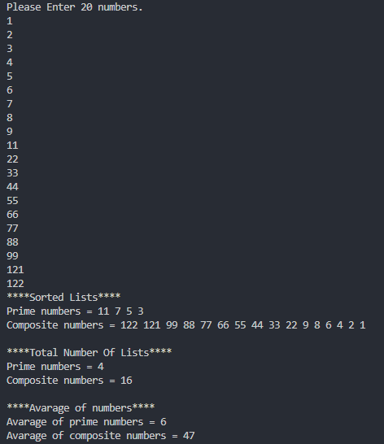

# Multi Purpose Calculator

This console app is ".NET Core Learning Path" project assignment prepared for [@Patika.dev](https://patika.dev)  


[![MIT License][license-shield]][license-url]
[![LinkedIn][linkedin-shield]][linkedin-url]

Program has five different actions.
- 
  Finding prime numbers from given 20 numbers.

- Finding composite numbers from given 20 numbers..
- Sorting prime and composite numbers.
- Counting the prime and composite numbers.
- Calculating the avarage of prime and composite numbers.



## Installation

Just clone the repo and open with Vs Code.

```git clone
https://github.com/berkturgut/kodluyoruzilkrepo.git 
```

## Usage example

* You should enter 20 different positive integer numbers.
* If you enter a character other than positive integer program will throw an error.

## Roadmap

- [x] Readme.md
    - [x] Add Readme.md
    - [x] Usage Example
- [ ] Bug fix 


<!-- CONTRIBUTING -->
## Contributing

If you have a suggestion that would make this better, please fork the repo and create a pull request. You can also simply open an issue with the tag "enhancement".
Don't forget to give the project a star! Thanks again!

1. Fork the Project
2. Create your Feature Branch (`git checkout -b feature/AmazingFeature`)
3. Commit your Changes        (`git commit -m 'Add some AmazingFeature'`)
4. Push to the Branch         (`git push origin feature/AmazingFeature`)
5. Open a Pull Request


<!-- LICENSE -->
## License

Distributed under the MIT License. See `LICENSE.txt` for more information.

<!-- CONTACT -->
## Contact

Berk Turgut - berkturgut@outlook.com

Project Link : [https://github.com/berkturgut/patika-dev-projects](https://github.com/berkturgut/patika-dev-projects/tree/main/csharp-101/consoleapp-homework-csharp)

## Acknowledgments

* [Patika.dev - C# 101 ](https://app.patika.dev/courses/csharp-101)


<!-- Markdown link & img dfn's -->
[license-shield]: https://img.shields.io/github/license/github_username/repo_name.svg?style=for-the-badge
[license-url]: https://github.com/berkturgut/patika-dev-projects/blob/main/csharp-101/consoleapp-homework-csharp/LICENSE.txt
[linkedin-shield]: https://img.shields.io/badge/-LinkedIn-black.svg?style=for-the-badge&amp;amp;logo=linkedin&amp;amp;colorB=555
[linkedin-url]: https://linkedin.com/in/berk-turgut
[wiki]: https://github.com/yourname/yourproject/wiki
